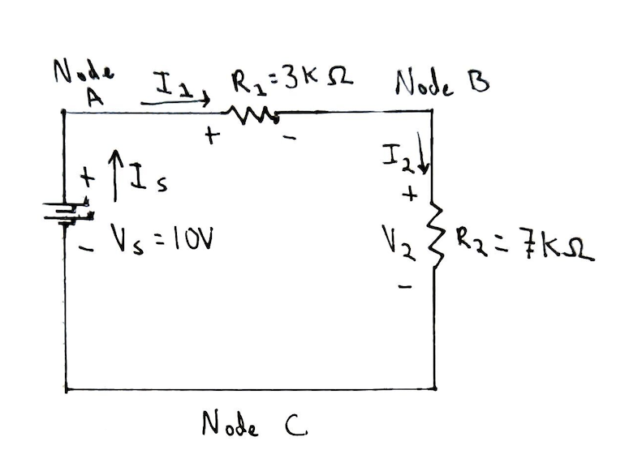

# Problem 1

A series circuit with 3 devices.

- 10 V Power Source
- Resistor 1 = 3kΩ
- Resistor 2 = 7kΩ

1. Label the device terminals with the proper voltage polarities (+ and –) and voltage variables.
2. Assign the directions of the currents for the given circuit.
3. Formulate KVL or KCL connection equations.
4. Apply device equations (such as Ohm’s law for resistors) and then substitute the device equations into the connection equations.
5. Solve for the voltage and current for any device.

(1 and 2)

