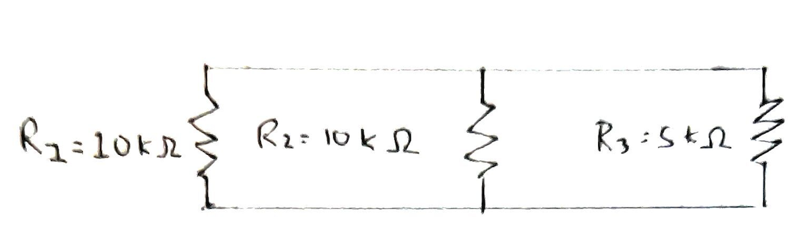
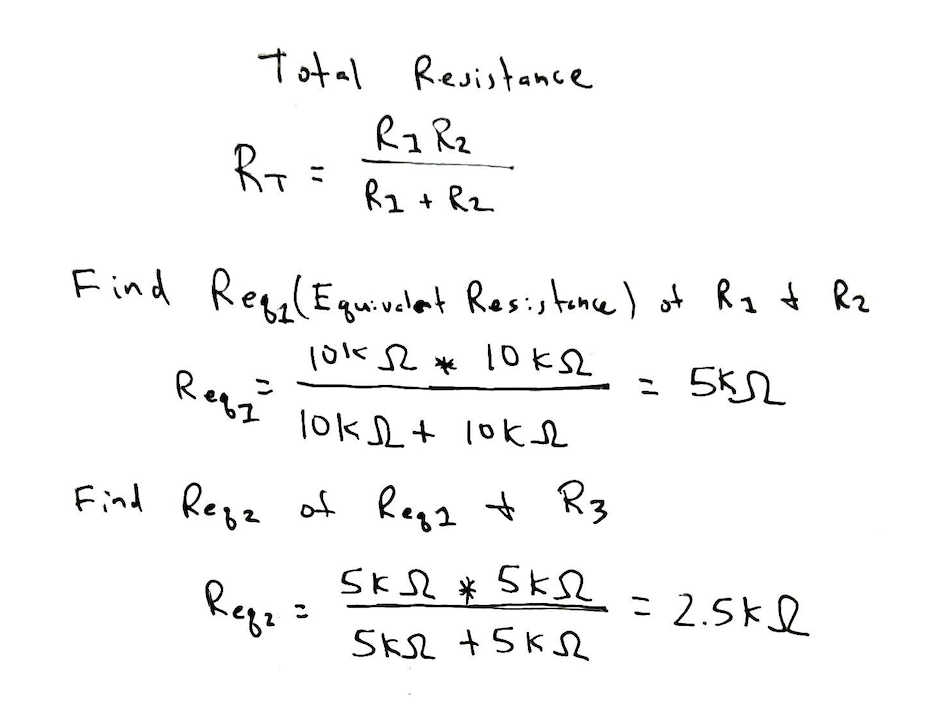

# Problem 2

### 3 resistors connected in parallel

- Resistor 1 = 10kΩ
- Resistor 2 = 10kΩ
- Resistor 3 =  5kΩ

Use the following formula to reduce two resistors (R1 and R2) in parallel to
the value of one single equivalent resistor. 

Then reduce again using the equivalent resistance (Req1 and R3).

