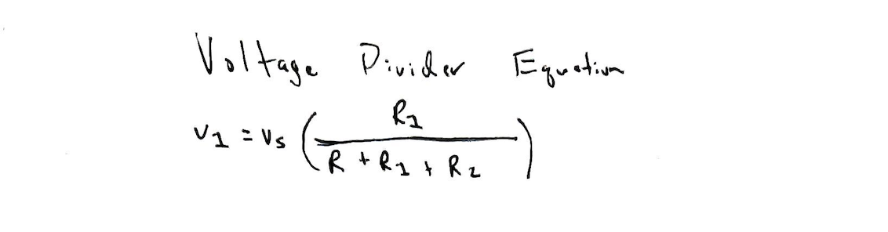
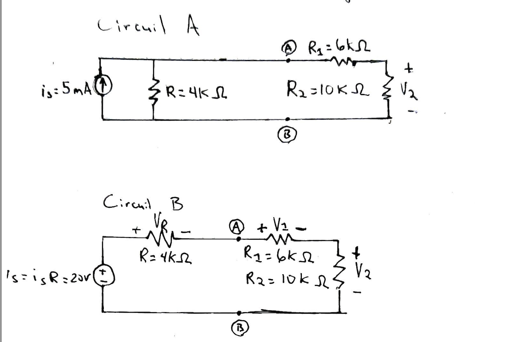

# Problem 3

### A circuit with a current at a voltage source and resistors both in series and in parallel

- Resistor (R)  =  4kΩ
- Resistor (R1) =  6kΩ
- Resistor (R2) = 10kΩ
- Current at Voltage Source = 5mA

Given a current at the voltage source, use the voltage divider technique to find the voltages across the resistors.

### Voltage Divider Equation

### First transform Circuit A into Circuit B

### Use the voltage divider technique

