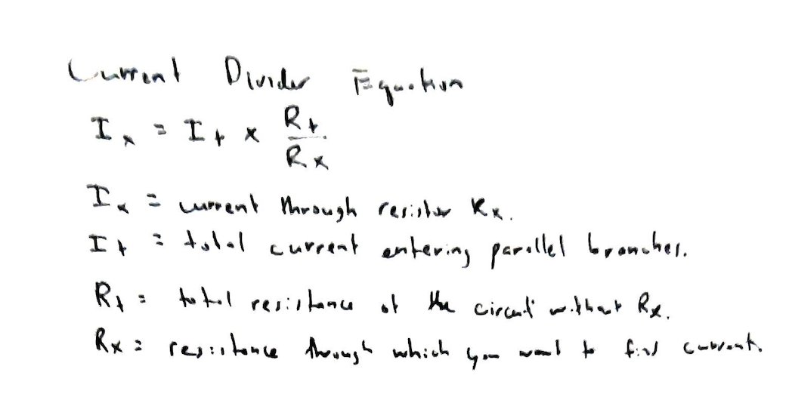
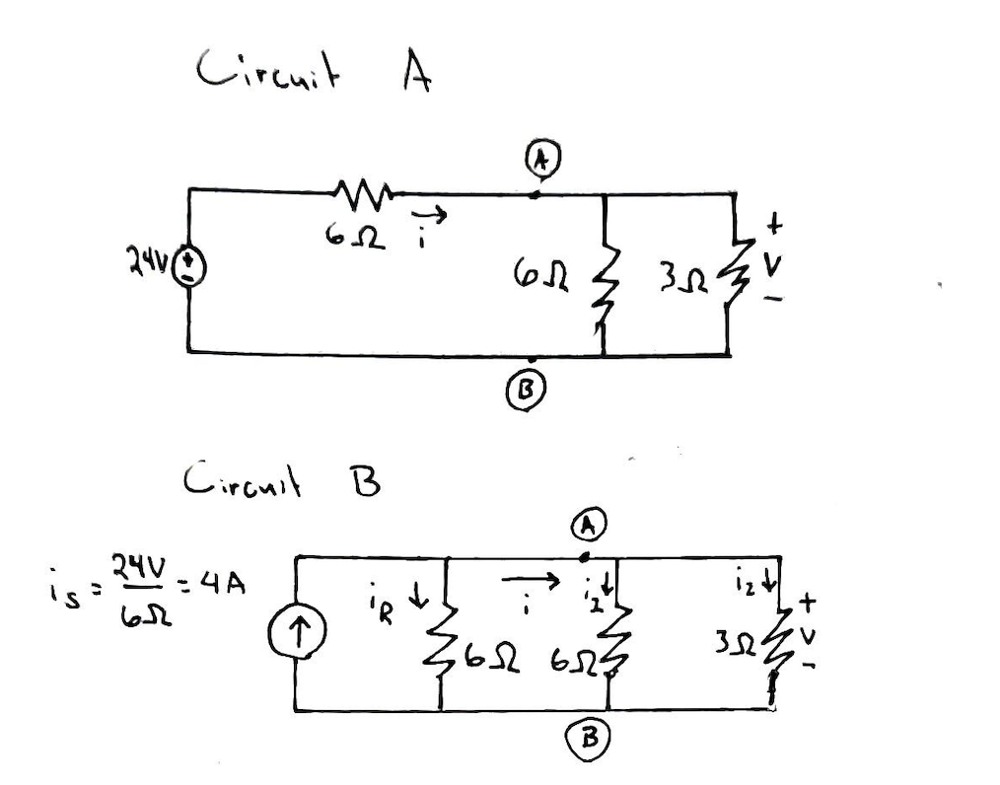
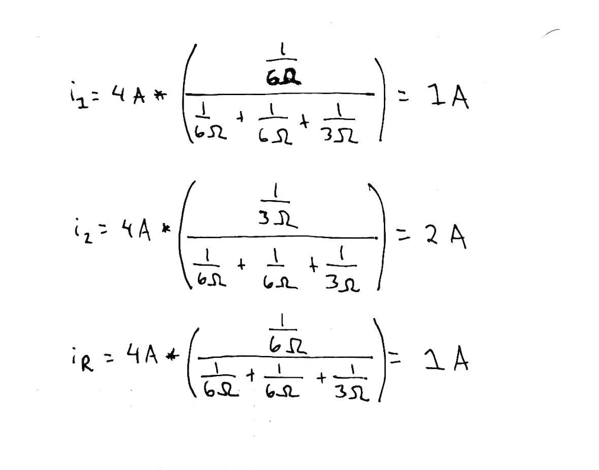

# Problem 4

### A circuit with a current at a voltage source and resistors both in series and in parallel

Given a voltage at the voltage source, use the current divider technique to find the current across the resistors.

### Current Divider Equation

### First transform Circuit A into Circuit B

### Use the current divider technique

