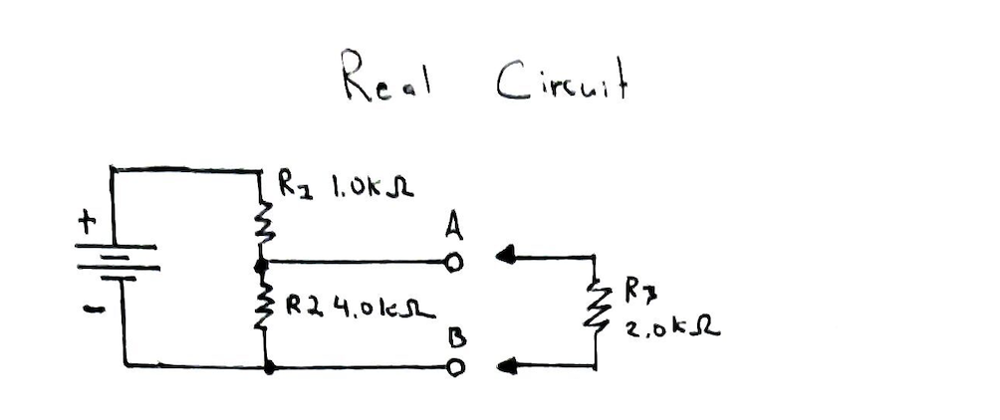
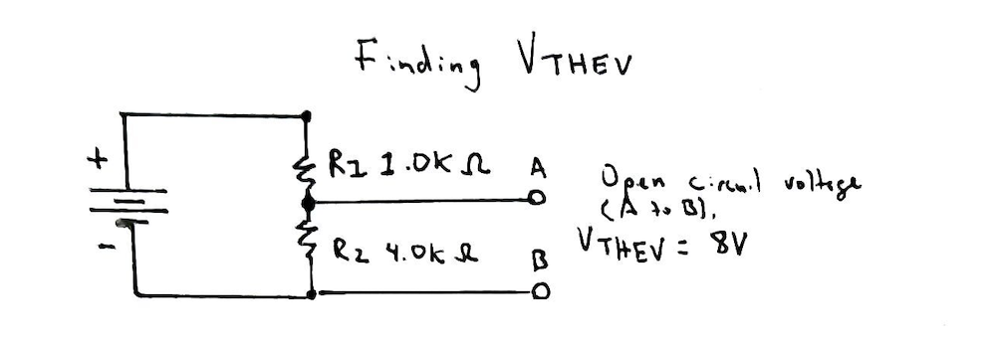
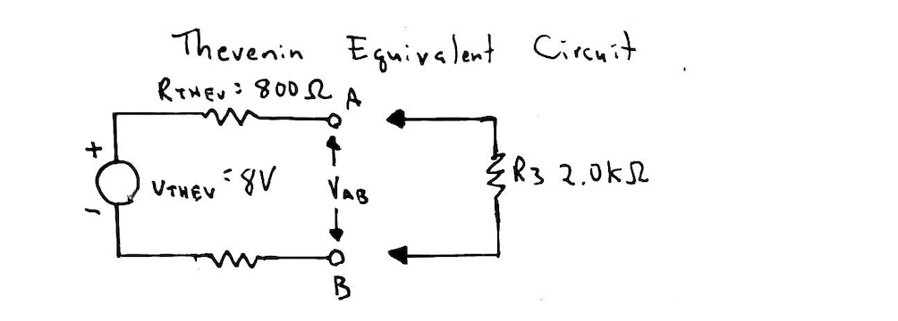
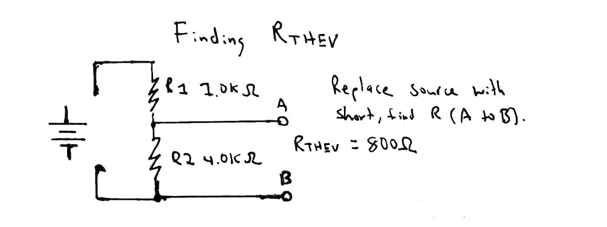
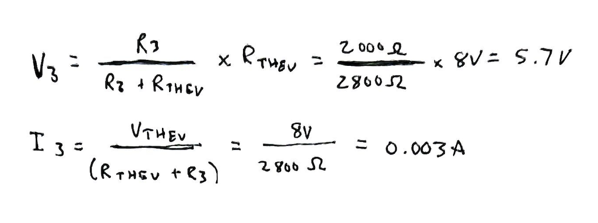

# Problem 7

### Thevenin's Theorem

If two terminals are of interest, these two terminals can 
be extracted from the complex circuit, and the rest of the
circuit can be considered a black box.

### Consider the following circuit

### Find Vthev

First remove the load R3 and open up the terminals of
interest (A and B). Then, determine the Thevenin voltage
Vthev using Ohm's law or the voltage divider equation.
It's the open-circuit across A and B.

### Thevenin Equivalent Circuit

### Find Rthev

Calculate the Thevenin resistance Rthev across terminals
A and B by replacing the dc source (Vbat) with a short
and calculating the resistance across A and B.

Rthev is simply R1 and R2 in parallel.

### Calculate the voltage and the current

