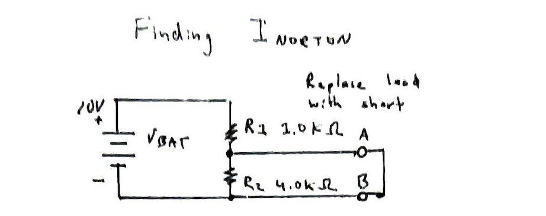
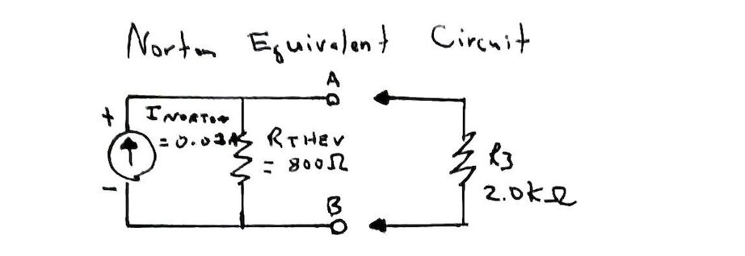
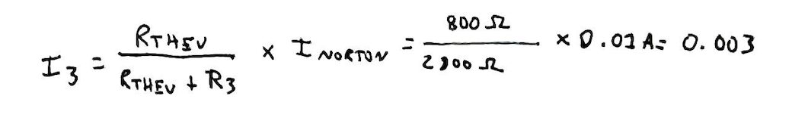

# Problem 8

### Norton's Theorem

Norton's theorem is to current sources as Thevenin's theorem
is to voltage sources.

The Norton equivalent circuit consists of a current source
in parallel with a resistance - which is the same as the
Thevenin resistance. 

The new trick is finding the value of the current sources.

### Consider the following circuit

### Remove the load R3 and replace it with a short.

Using Ohm's law, and noticing no current will ideally
flow through R2 since it's shorted, you find the short-circuit
current, or Norton current, to be:

We now have a Norton Equivalent circuit, and we know
Rthev from the previous problem (Problem 7).

Replacing R3, we can now determine how much current will flow through R3, using Ohm's law or applying the current divider
equation.

